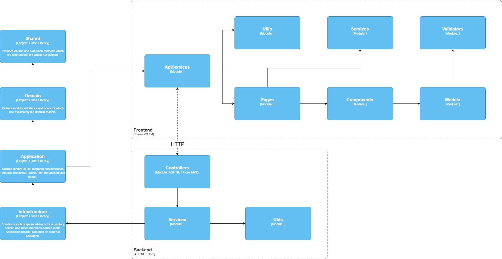
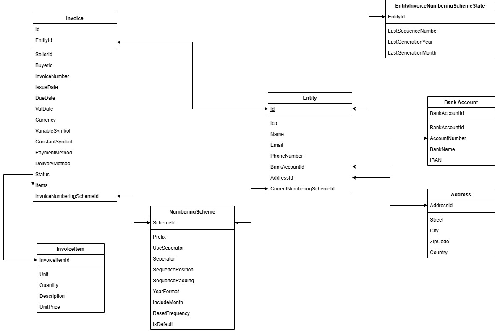

# Invoicer Application - Developer Documentation

## 1. Introduction

Welcome to the Invoicer application documentation. This document provides developers with an overview of the project structure, key components, technologies used, and guidelines for development.

The application aims to provide functionality for creating, managing, and potentially generating PDF versions of invoices, along with managing related entities like customers/business entities, bank accounts, and numbering schemes.

## 2. Getting Started

### Prerequisites

*   .NET SDK 8.0
*   Docker (for containerized development and deployment)
*   An IDE (preferably Visual Studio 2022)

### Setup & Running

1.  **Clone the repository:**
    ```bash
    git clone https://github.com/S1lence-z/invoicer-web-app.git
    cd invoicer-web-app/invoicer
    ```
2.  **Restore Dependencies:**
    ```bash
    dotnet restore Invoicer.sln
    ```
3.  **Database Setup:**
    *   Create the database file `Invoicer.db` in the `Backend/Database/` directory.
    *   Apply Entity Framework Core migrations:
        ```bash
         dotnet ef migrations add InitialCreate -p .\Infrustructure\ -s .\Backend\
         dotnet ef database update -s .\Backend\
        ```
    * The `Backend/Database/Patches/InsertSampleData.sql` script might be available for seeding initial data for testing. Execute this against your database if needed.
4.  **Run the Application:**

    * Using Docker Compose:
        * Development mode:
            ```bash
            docker compose -f docker-compose.dev.yml up
            ```
        * Staging mode:
            ```bash
            docker compose -f docker-compose.staging.yml up
            ```
   * Manually:
     * Backend API:
        ```bash
        cd src/Backend
        dotnet run
        ```
        For the URL, check the console output.

     * Frontend UI:
        ```bash
        cd src/Frontend
        dotnet run
        ```
        For the URL, check the console output.

## 3. Project Architecture Overview

### Architecture Diagram

The solution follows a multi-project structure, currently organized as follows:



#### 3.1. `Invoicer.Shared`

*   **Purpose:** A library for code shared across multiple projects, primarily `Frontend` and `Backend`.
*   **Key Contents:**
    *   `Enums/`: Enumerations used across different layers (`InvoiceStatus.cs`, `Currency.cs`)
    *   `Extensions/`: Extension methods for common types (`StringExtensions.cs`, `DateTimeExtensions.cs`)

#### 3.2. `Invoicer.Domain`

*   **Purpose:** Contains the core business logic, models (entities), and domain-specific rules, independent of other layers.
*   **Key Contents:**
    *   `Models/`: Contains Plain Old C# Objects (POCOs) representing the core business entities (`Invoice.cs`, `Entity.cs`). These should ideally only contain data and core business rules/methods.
    *   `Services/`: Contains domain services encapsulating logic that doesn't naturally belong to a single entity (`InvoiceNumberGenerator.cs`)
    *   `Interfaces/`: Defines interfaces for domain services or abstractions needed *within* the domain itself (`IInvoiceNumberGenerator.cs`)

#### 3.3. `Invoicer.Application`

*   **Purpose:** Intended to orchestrate application use cases/features. It defines interfaces for infrastructure concerns and contains application-specific logic like mapping.
*   **Key Contents:**
    *  `AresApi/`: Contains models and services related to the ARES API integration, models and contracts.
    *  `DTOs/`: Data Transfer Objects used for communication between layers, especially between `Backend` and `Frontend` (`InvoiceDto.cs`)
    *  `Extensions`: Extension methods for DTOs (`InvoiceDtoExtensions.cs`)
    *  `ExternalServiceInterfaces/`: Contains interfaces for external services (`IAresApiService.cs`, `IInvoicePdfGenerator.cs`), which are implemented in the `Infrastructure` layer.
    *  `Interfaces/`: Defines base interfaces (`IRepository.cs`, `IResult.cs`, `IService.cs`)
    *  `Mappers/`: Contains logic to convert between Domain entities and Data Transfer Objects (DTOs) or other models (`InvoiceMapper.cs`)
    *  `RepositoryInterfaces/`: Contains interfaces for repositories, which are implemented in the `Infrastructure` layer (`IInvoiceRepository.cs`, `IEntityRepository.cs`)
    *  `ServiceInterfaces/`: Contains interfaces for application services, which are implemented in the `Infrastructure` layer (`IInvoiceService.cs`, `IEntityService.cs`) 

#### 3.4. `Invoicer.Infrastructure`
*   **Purpose:** Dedicated project for infrastructure concerns, including database access, external service integrations, and implementations of application services.
  * **Key Contents:**
    *  `Persistance/`: Contains the Entity Framework Core `DbContext` (`ApplicationDbContext.cs`), migrations (`Migrations/`) and the database itself (Sqlite).
    *  `Repositories/`: Contains concrete implementations of repository interfaces defined in `Application` (`InvoiceRepository.cs`, `EntityRepository.cs`).
    *  `ExternalServices/`: Contains implementations of external service interfaces defined in `Application` (`AresApiService.cs`, `InvoicePdfGenerator.cs`).

#### 3.5. `Invoicer.Backend`

*   **Purpose:** Currently serves multiple roles:
    1.  **API Layer:** Exposes HTTP endpoints for the `Frontend` or other clients.
    3.  **Composition Root:** Configures dependency injection, middleware, and application startup (`Program.cs`).
*   **Key Contents:**
    *   `Controllers/`: ASP.NET Core API controllers handling incoming HTTP requests (e.g., `InvoiceController.cs`).
    *   `Services/`: Contains concrete implementations of services, including those performing data access using EF Core (`InvoiceService.cs`, `AddressService.cs`)
    *   `Utils/`: Utility classes specific to the backend (`EntityInvoiceNumberingStateUpdater.cs`, ...)

#### 3.6. `Invoicer.Frontend`

*   **Purpose:** The user interface layer, built using Blazor WebAssembly. It interacts with the `Backend` via HTTP API calls.
*   **Key Contents:**
    *   `Api/`: Contains client-side services or typed HttpClients responsible for calling the `Backend` API endpoints (e.g., `InvoiceService.cs` here calls the `Backend`'s `InvoiceController`).
    *   `Pages/`: Routable Blazor components representing application pages (.razor files).
    *   `Utils/`: Utility classes specific to the frontend (`NavLinkItem.cs`, `NavMenuItemsProvider.cs`).
    *   `Components/`: Reusable Blazor UI components (.razor files).
    *   `Services/`: Client-side services for UI logic (e.g., `LoadingService.cs`, `ErrorService.cs`).
    *   `Models/`: Contains View Models specific to the Frontend (e.g., `InvoiceFormModel.cs`).
    *   `Validators/`: Custom validation attributes used in forms.
    *   `Layout/`: Defines the main application layout structure (`MainLayout.razor`, `NavMenu.razor`).

## 4. Technology Stack

*   **.NET Platform:** :NET 8.0
*   **Backend Framework:** ASP.NET Core Web API
*   **Frontend Framework:** Blazor WebAssembly
*   **Database:** SQLite
*   **ORM:** Entity Framework Core
*   **PDF Generation:** QuestPDF

## 5. Dependencies Overview

*   `Shared` -> None
*   `Domain` -> `Shared`
*   `Application` -> `Domain`
*   `Infrastructure` -> `Application`
*   `Backend` -> `Infrastructure`
*   `Frontend` -> `Application`

**Interaction:** `Frontend` interacts with `Backend` primarily via HTTP calls defined in `Frontend/Api/` services, targeting the controllers in the `Backend` project.

## 6. Database Model
### Database Structure


## 7. Key Concepts & Features

*   **Invoicing:** Core functionality revolves around creating, reading, updating, and deleting Invoices and InvoiceItems. Domain models and Backend services/controllers are central.
*   **Entity Management:** Managing business entities (customers/suppliers) that issue or receive invoices.
*   **Numbering Schemes:** Configurable schemes for generating sequential invoice numbers, potentially per entity and year/period. See `Domain/Services/InvoiceNumberGenerator.cs` and related state management services (`IEntityInvoiceNumberingStateService`).
*   **PDF Generation:** Generating PDF documents for invoices. See `Application/Interfaces/IInvoicePdfGenerator.cs` and its implementation in `Backend/Utils/InvoicePdfGenerator/`.
*   **ARES API Integration:** Interacting with the ARES system (Czech business registry). See `Backend/Services/AresApiService.cs`, `Backend/Controllers/AresController.cs`, and related models in `Shared/Api/`.