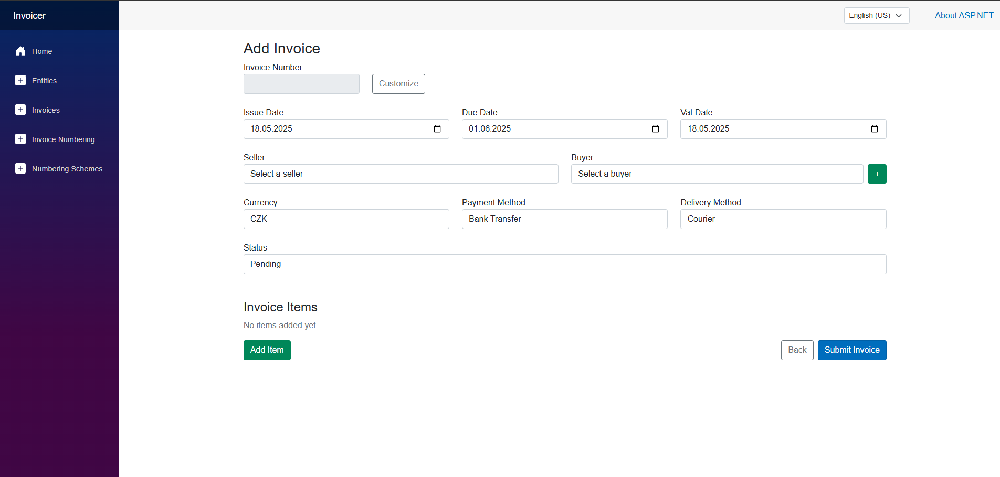
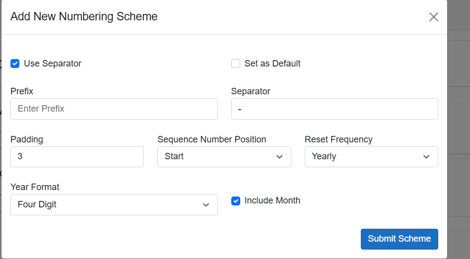
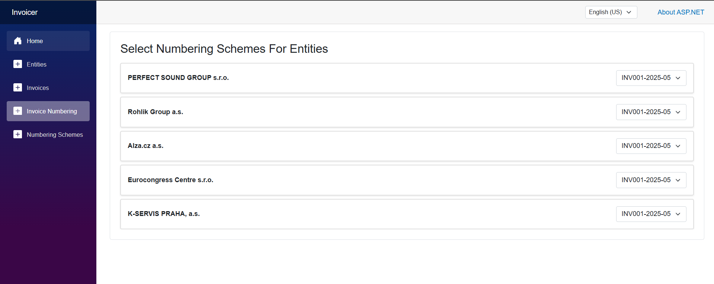

# Invoicer - User Documentation

## 1. Introduction

Welcome to Invoicer! This application helps you easily create, manage, and track your invoices, clients (Entities), and invoice numbering systems. This guide will walk you through the main features and how to use them.

## 2. Getting Started

### Accessing the Application
Simply open the Invoicer application URL in your web browser.

### Main Layout
The application has a consistent layout:

*   **Navigation Menu (Left):** Use this sidebar to navigate between the main sections: Home, Entities, Invoices, Invoice Numbering, and Numbering Schemes.
*   **Main Content Area (Center/Right):** This is where lists, forms, and details for the selected section are displayed.
*   **Header (Top Right):** You may find options here like language selection.

**Home Screen**
When you first open Invoicer, you'll see the welcome screen. Use the navigation menu on the left to get started.

## 3. Managing Entities (Clients/Suppliers)

The "Entities" section allows you to manage the businesses or individuals you invoice or who invoice you.

### Viewing Entities
1.  Click **Entities** in the left navigation menu.
2.  You will see a list of existing Economic Entities on the left side of the screen. Each entry shows the name, bank details, and address.
3.  You can scroll through the list if you have many entities.

### Adding a New Entity
1.  Navigate to the **Entities** screen.
2.  Click the **Add New Entity** button (usually located in the top right of the content area).
3.  You will be redirected to the "Add Entity" page.
4.  **(Optional - Czech Entities):** If you know the Czech ICO (IÈO) number, enter it in the **Enter ICO...** field at the top and click **Fill In**. The system may attempt to automatically populate some fields based on the ARES registry.
5.  **Fill in the details:**
    *   Name
    *   ICO (IÈO - Identification Number)
    *   Email Address
    *   Phone Number
    *   Street And Number
    *   Zip Code
    *   City
    *   Country
    *   Account Number
    *   Bank Code
    *   Bank Name
    *   IBAN
6.  Once all required information is entered, click the **Submit** or **Save** button (likely at the bottom of the pop-up, though not fully visible in the screenshot).

)

### Editing an Entity
1.  Navigate to the **Entities** screen.
2.  Find the entity you wish to edit in the list.
3.  Click the **Edit** button associated with that entity.
4.  A form similar to the "Add New Entity" pop-up will appear, pre-filled with the entity's current details.
5.  Make the necessary changes.
6.  Click **Submit** or **Save**.

### Deleting an Entity
1.  Navigate to the **Entities** screen.
2.  Find the entity you wish to delete in the list.
3.  Click the **Delete** button associated with that entity.
4.  You will likely be asked to confirm the deletion. Confirm to permanently remove the entity. **Caution:** Deleting an entity might affect associated invoices.

## 4. Managing Invoices

This section covers creating and managing your invoices.

### Viewing Invoices
1.  Click **Invoices** in the left navigation menu.
2.  A table displaying your invoices will appear.
3.  The table shows columns like: Invoice Number, Seller, Buyer, Due Date, Status, Total with VAT, and Actions.
4.  You can use the **Search invoices...** bar at the top to find specific invoices (e.g., by number, seller, or buyer - functionality may vary).

### Adding a New Invoice
1.  Navigate to the **Invoices** screen.
2.  Click the **Add New Invoice** button (top right).
3.  An "Add New Invoice" page will appear.
4.  **Fill in the Invoice Header details:**
    *   **Invoice Number:** This may be generated automatically based on your numbering schemes. You might be able to click **Customize** to enter a specific number if needed (use with caution).
    *   **Issue Date, Due Date, VAT Date:** Enter or select the relevant dates.
    *   **Seller:** Select the entity issuing the invoice from the dropdown list.
    *   **Buyer:** Select the entity receiving the invoice from the dropdown list.
    *   **Currency:** Enter the currency code (e.g., CZK, EUR).
    *   **Payment Method:** Select the method (e.g., Bank Transfer).
    *   **Delivery Method:** Select the method (e.g., Courier).
    *   **Status:** Set the initial status (e.g., Pending).
5.  **Add Invoice Items:**
    *   Go to the "Invoice Items" section at the bottom of the pop-up.
    *   For each item you want to add:
        *   Enter a **Description**.
        *   Enter the **Quantity**.
        *   Specify the **Unit** (e.g., pcs, kg, hour).
        *   Enter the **Unit Price** (before VAT).
        *   Enter or select the **VAT Rate** (e.g., 0.21 for 21%).
    *   Click the **Add Item** button to add another line item row.
    *   Click the **Remove** button next to an item row to delete it.
6.  If you forgot to add a buyer entity, you can click the **+** button next to the "Select a buyer" field to create a new entity directly from the invoice form.
7.  Once all header details and line items are complete, click the **Submit Invoice** button.

### Editing an Invoice
1.  Navigate to the **Invoices** screen.
2.  Find the invoice you wish to edit in the list.
3.  Click the **Edit** button in the "Actions" column for that invoice.
4.  A form similar to the "Add New Invoice" pop-up will appear with the invoice details.
5.  Make the necessary changes to the header or line items.
6.  Click **Submit** or **Save**.

### Deleting an Invoice
1.  Navigate to the **Invoices** screen.
2.  Find the invoice you wish to delete.
3.  Click the **Delete** button in the "Actions" column.
4.  Confirm the deletion when prompted.

### Previewing/Exporting an Invoice
1.  Navigate to the **Invoices** screen.
2.  Find the desired invoice.
3.  Click the **Preview** or **Export** button in the "Actions" column.
4.  This action will likely generate and download a PDF version of the invoice.

## 5. Managing Numbering Schemes

This section allows you to define how your invoice numbers are automatically generated and assign those formats to specific entities.

### Defining Numbering Scheme Formats
1.  Click **Numbering Schemes** in the left navigation menu.
2.  You will see a list of currently defined numbering schemes, showing an example format and whether it's the default.

]

3.  To add a new format, click **Add Numbering Scheme**.
4.  An "Add New Numbering Scheme" pop-up will appear.
5.  **Configure the scheme:**
    *   **Use Separator:** Check this if you want a separator character between parts of the invoice number.
    *   **Set as Default:** Check this if this scheme should be the default for new entities or invoices where no specific scheme is assigned.
    *   **Prefix:** Enter any fixed text you want at the beginning (e.g., "INV").
    *   **Separator:** Enter the character to use as a separator (e.g., "-"). Only applicable if "Use Separator" is checked.
    *   **Padding:** Enter the number of digits the sequence number should have (e.g., 3 means numbers like 001, 002,... 010).
    *   **Sequence Number Position:** Choose where the sequential number appears (Start, End, Middle - options may vary).
    *   **Reset Frequency:** Choose when the sequence number resets (e.g., Yearly, Monthly, Never).
    *   **Year Format:** Choose how the year is displayed (e.g., Four Digit '2025', Two Digit '25').
    *   **Include Month:** Check this if you want the month included in the format.
6.  Click **Submit Scheme** to save the new format.

7.  You can **Edit** or **Delete** existing schemes from the list view (Screenshot 7) using the respective buttons.

### Assigning Schemes to Entities
1.  Click **Invoice Numbering** in the left navigation menu. *(Note: The screenshot title says "Select Numbering Schemes For Entities", this section links entities to the formats defined above)*.
2.  You will see a list of your Economic Entities.
3.  Next to each entity name, there is a dropdown menu.
4.  Click the dropdown for an entity and select the desired **pre-defined Numbering Scheme** (created in the previous step) that should be used when generating invoices *for* that entity (or *by* that entity, depending on application logic).
5.  Changes are likely saved automatically as you select them, or there might be a save button (not visible).

